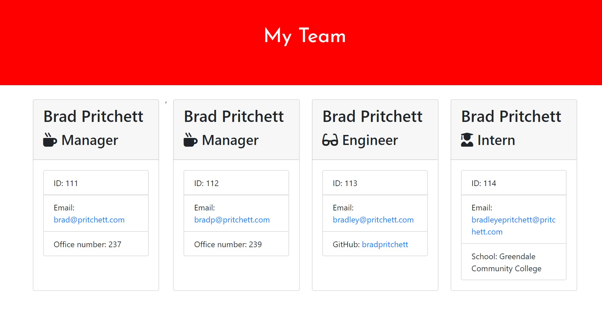

# Team Tracker

## Description
This simple project allows users to generate an organization chart for their company, provided their company only employs managers, engineers and interns. 

Users are prompted via CLI on each team member. After each team member is entered the user is asked if they would like to add another. If they do, then another employee can be added. Otherwise, the team.html file is generated.

## Watch the video
A demo video can be viewed [here](https://drive.google.com/file/d/1oBXdBEIWgOQ9TCkCYtTBZS-9eQHJmr8N/view)
## Installation Instructions
Requires NODE. Run npm i to install dependencies.
## Questions
If you have any questions, my github handle is <https:github.com/bradpritchett> and I can be reached at <bradpritchett1@msn.com>
